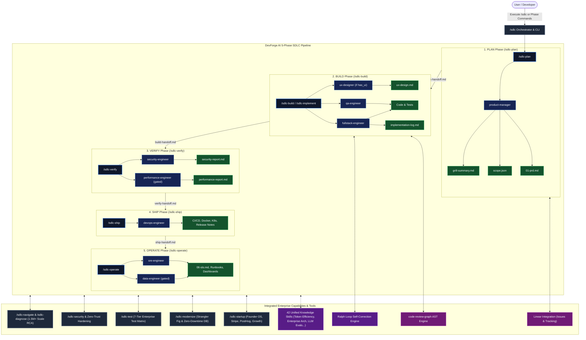
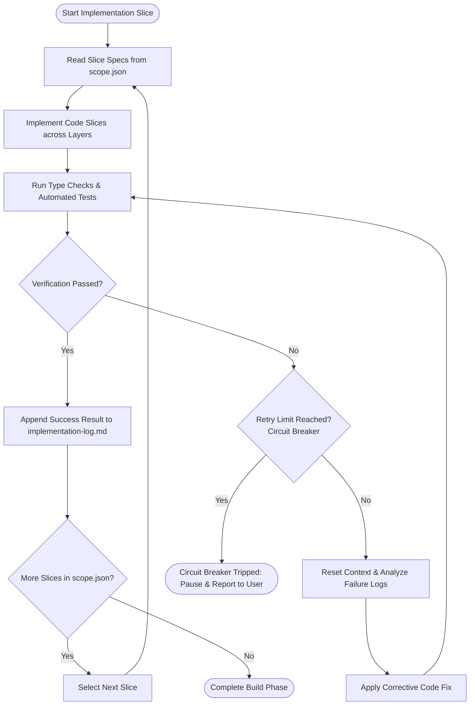
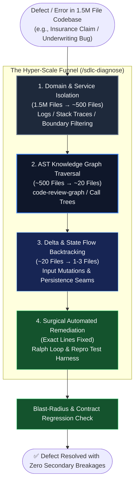
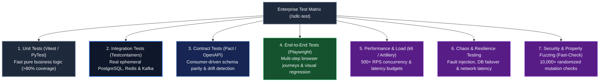
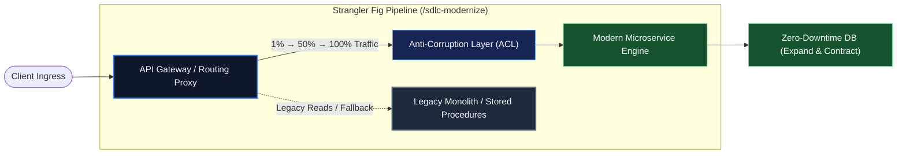

<p align="center">
  <a href="https://github.com/saitarrun/devforge-ai">
    
  </a>
</p>

# DevForge AI

> **Optimised SDLC AI workflow** — 10 role-specific agents × 5 phases with tracer bullet delivery and self-correction loops

<p align="center">
  <a href="https://www.npmjs.com/package/@saitarrunpitta/devforge-ai"></a>
  <a href="LICENSE"></a>
  <a href="https://nodejs.org/">=18.0.0-green?style=flat-square&logo=node.js" alt="Node.js"></a>
  <a href="https://github.com/saitarrun/devforge-ai"></a>
</p>

An agentic SDLC orchestration system for Claude Code. DevForge AI turns an idea into a planned, built, verified, shipped, and operated feature using role-specific agents, tracer bullet slices, quality gates, and handoff documents.

This is not a one-shot code generator. DevForge AI is a delivery workflow: product thinking first, thin vertical slices, feedback loops, security and performance checks, deployment assets, and operational follow-through.

## Quickstart

1. Install the package:

```bash
sudo npm install -g devforge-ai
```

2. Install the DevForge AI agents, skills, commands, and integrations into Claude Code:

```bash
devforge-ai install
```

3. Restart Claude Code, then view the interactive navigator:

```bash
/sdlc-help
```

4. Or run commands by scenario:

```bash
# 🚀 Full Autonomous Pipeline & Startups
/sdlc "build a login page"
/sdlc-startup "AI copilot for insurance brokers"

# 🔍 Codebase Exploration & Root Cause Debugging (Up to 1.5M Files)
/sdlc-navigate "AuthService"
/sdlc-diagnose "500 error in checkout calculation"

# 🛡️ Security, Patching, Tests, & Legacy Modernization
/sdlc-security --fix-cves
/sdlc-modernize "legacy_engine.c"
/sdlc-test --suite all
```

## System Architecture



### SDLC Phase Handoff Sequence Diagram

```mermaid
sequenceDiagram
    autonumber
    actor User as Developer / User
    participant Orchestrator as /sdlc Orchestrator
    participant Plan as Phase 1: Plan (/sdlc-plan)
    participant Build as Phase 2: Build (/sdlc-build)
    participant Verify as Phase 3: Verify (/sdlc-verify)
    participant Ship as Phase 4: Ship (/sdlc-ship)
    participant Operate as Phase 5: Operate (/sdlc-operate)
    participant Storage as Project Artifacts Store

    User->>Orchestrator: Run /sdlc "Feature Prompt"
    
    rect rgb(15, 23, 42)
        note over Plan: Product Manager Agent
        Orchestrator->>Plan: Trigger /sdlc-plan
        Plan->>User: Conduct structured interview (grill-me)
        User-->>Plan: Requirements & Answers
        Plan->>Storage: Save grill-summary.md & scope.json (Tracer Bullet Slices)
        Plan->>Storage: Save 01-prd.md & Linear Issues
        Plan->>Storage: Write plan-handoff.md
    end

    rect rgb(23, 37, 84)
        note over Build: UX Designer, Fullstack Engineer, QA Engineer
        Orchestrator->>Build: Trigger /sdlc-build (Reads plan-handoff.md)
        opt UI Feature (has_ui = true)
            Build->>Storage: Save ux-design.md
        end
        loop For Each Slice in scope.json (Ralph Loop)
            Build->>Build: Implement Slice across Schema/API/UI
            Build->>Build: Run Tests & Typechecks (Self-Correction Loop)
            Build->>Storage: Append slice output to implementation-log.md
        end
        Build->>Build: Run Cross-Slice E2E Tests (qa-engineer)
        Build->>Storage: Write build-handoff.md
    end

    rect rgb(30, 41, 59)
        note over Verify: Security & Performance Engineers
        Orchestrator->>Verify: Trigger /sdlc-verify (Reads build-handoff.md)
        Verify->>Storage: Save security-report.md (SAST / OWASP)
        opt Performance Audit Required
            Verify->>Storage: Save performance-report.md
        end
        Verify->>Storage: Write verify-handoff.md
    end

    rect rgb(20, 83, 45)
        note over Ship: DevOps Engineer
        Orchestrator->>Ship: Trigger /sdlc-ship (Reads verify-handoff.md)
        Ship->>Storage: Generate CI/CD, Dockerfile, K8s manifests, Release Notes
        Ship->>Storage: Write ship-handoff.md
    end

    rect rgb(88, 28, 135)
        note over Operate: SRE & Data Engineers
        Orchestrator->>Operate: Trigger /sdlc-operate (Reads ship-handoff.md)
        Operate->>Storage: Save 06-slo.md, Runbooks, Dashboard Configs
    end

    Orchestrator-->>User: Pipeline Complete with Output Summary
```



### Ralph Loop Self-Correction Flowchart



### Hyper-Scale Root Cause Analysis (1.5M Files -> 1 File)



### Enterprise Multi-Tier Test Suite Matrix



### Industrial Legacy Modernization (Strangler Fig)



## Install From Source

```bash
git clone https://github.com/saitarrun/devforge-ai
cd devforge-ai
npm install
npm run install-local
```

Restart Claude Code after installing. See [INSTALLATION.md](INSTALLATION.md) for update, symlink, and uninstall instructions.

## Why DevForge AI Exists

DevForge AI is built around the common places AI-assisted engineering breaks down.

### 1. The Agent Builds The Wrong Thing

The first failure mode is misalignment. A feature request sounds obvious until the agent fills in the wrong blanks.

DevForge AI starts with `/sdlc-plan`, where the `product-manager` agent runs a structured interview, writes `grill-summary.md`, produces `scope.json`, synthesizes a PRD, and creates implementation issues. The result is a concrete build plan before any code is written.

Use this when:

- The idea is still fuzzy
- You need user stories and acceptance criteria
- You want vertical slices instead of a giant implementation blob
- You want requirements captured as artifacts, not lost in chat history

### 2. The Work Is Too Big To Trust

Large agent tasks fail because the feedback loop is too slow. DevForge AI breaks features into tracer bullet slices: thin increments that cut through schema, API, UI, and tests where needed.

Each slice is tracked in `scope.json`:

```json
{
  "capability_flags": {
    "has_ui": true,
    "has_auth": true
  },
  "slices": [
    {
      "id": "slice-0",
      "name": "Project scaffold + health check",
      "type": "prefactor",
      "layers": ["schema", "api", "tests"]
    },
    {
      "id": "slice-1",
      "name": "User can log in",
      "type": "feature",
      "layers": ["schema", "api", "ui", "tests"]
    }
  ]
}
```

The first slice establishes the foundation. Every later slice delivers one user-visible increment and appends its result to `implementation-log.md`.

### 3. The Code Does Not Work

DevForge AI uses the Ralph Loop during build work:

- Implement one slice
- Run the relevant type checks and tests
- Retry with fresh context when verification fails
- Stop at a circuit breaker instead of looping silently
- Run cross-slice QA after feature slices are complete

This gives the agent a disciplined feedback loop instead of relying on confidence.

### 4. The Process Loses Context

Long SDLC sessions can drown the model in stale conversation history. DevForge AI uses handoff documents at phase gates:

```text
plan-handoff.md   -> /sdlc-build
build-handoff.md  -> /sdlc-verify
verify-handoff.md -> /sdlc-ship
ship-handoff.md   -> /sdlc-operate
```

Each phase reads the handoff first, then starts with bounded context. Decisions survive, but unnecessary chat history does not.

### 5. Shipping Is Not The End

DevForge AI includes verification, deployment, and operations phases. The workflow does not stop when code compiles.

The later phases cover:

- Security review and OWASP checks
- Performance profiling when required
- CI/CD, Docker, Kubernetes, and infrastructure artifacts
- SLOs, monitoring, runbooks, and operational readiness
- Data pipeline planning when the feature needs it

## How The Pipeline Works

| Phase | Command | Primary agents | Output |
| --- | --- | --- | --- |
| Plan | `/sdlc-plan` | `product-manager` | `grill-summary.md`, `scope.json`, `01-prd.md`, issues |
| Build | `/sdlc-build` | `ux-designer`, `fullstack-engineer`, `qa-engineer` | `ux-design.md`, code, tests, `implementation-log.md` |
| Verify | `/sdlc-verify` | `security-engineer`, `performance-engineer` | security and performance reports |
| Ship | `/sdlc-ship` | `devops-engineer` | CI/CD, Docker, Kubernetes, IaC, release notes |
| Operate | `/sdlc-operate` | `sre-engineer`, `data-engineer` | SLOs, runbooks, monitoring, data pipeline docs |

Some agents are scope-gated:

- `ux-designer` runs when `has_ui` is true
- `performance-engineer` runs when `needs_performance_audit` is true
- `data-engineer` runs when `has_data_pipeline` is true
- Security monitoring is added when `has_auth` is true

## Project Artifacts

Every SDLC run writes into a project folder:

```text
./projects/<feature-name>/
  grill-summary.md
  scope.json
  docs/
    01-prd.md
    ux-design.md
    implementation-log.md
    security-report.md
    performance-report.md
    05-pipeline.log
    06-slo.md
  handoffs/
    plan-handoff.md
    build-handoff.md
    verify-handoff.md
    ship-handoff.md
```

## Reference

DevForge AI is split into commands, agents, and skills.

Commands are what you type. Agents are the role-specific workers. Skills are methodology documents that agents load when their task needs that discipline.

### Commands

- **[`/sdlc-help`](./commands/sdlc-help.md)** - Interactive command navigator and scenario guide (zero confusion).
- **[`/sdlc`](./commands/sdlc.md)** - Master orchestrator for the full Plan -> Build -> Verify -> Ship -> Operate pipeline.
- **[`/sdlc-plan`](./commands/sdlc-plan.md)** - Product planning, interview, PRD, scope, and issues.
- **[`/sdlc-build`](./commands/sdlc-build.md)** - UX design, slice implementation, Ralph Loop retries, and QA.
- **[`/sdlc-verify`](./commands/sdlc-verify.md)** - Security and performance verification.
- **[`/sdlc-ship`](./commands/sdlc-ship.md)** - CI/CD, cloud infrastructure, containerization, and release.
- **[`/sdlc-operate`](./commands/sdlc-operate.md)** - SLOs, runbooks, monitoring, and data pipelines.
- **[`/sdlc-implement`](./commands/sdlc-implement.md)** - Standalone issue or free-form implementation with Ralph Loop verification.
- **[`/sdlc-navigate`](./commands/sdlc-navigate.md)** - Structural codebase navigation, symbol call-graphs, impact analysis, and module boundary mapping.
- **[`/sdlc-diagnose`](./commands/sdlc-diagnose.md)** - Automated Root-Cause Analysis (RCA) and surgical fix engine for massive 1.5M+ file repositories.
- **[`/sdlc-security`](./commands/sdlc-security.md)** - Automated security vulnerability remediation, CVE patching, and Zero-Trust protocol hardening.
- **[`/sdlc-modernize`](./commands/sdlc-modernize.md)** - Industrial legacy modernization, Strangler Fig migrations, and zero-downtime schema evolution.
- **[`/sdlc-test`](./commands/sdlc-test.md)** - Enterprise multi-tier test suite execution (Unit, Integration, Contract, E2E, Load/k6, Chaos, Fuzzing).
- **[`/sdlc-startup`](./commands/sdlc-startup.md)** - End-to-end founder & startup playbook: Stripe billing, PostHog telemetry, and unit economics.
- **[`/sdlc-review`](./commands/sdlc-review.md)** - Pull request review using parallel reviewer perspectives.
- **[`/to-prd`](./commands/to-prd.md)** - Regenerate a PRD from existing planning artifacts.
- **[`/to-issues`](./commands/to-issues.md)** - Create one issue per tracer bullet slice from `scope.json`.

### Agents

- **[`product-manager`](./agents/product-manager.md)** - Runs the planning interview, decomposes features, writes `scope.json`, and drives PRD and issue creation.
- **[`ux-designer`](./agents/ux-designer.md)** - Produces wireframes, design tokens, component specs, and interaction states when the feature has UI.
- **[`fullstack-engineer`](./agents/fullstack-engineer.md)** - Implements vertical slices across schema, API, UI, and tests.
- **[`qa-engineer`](./agents/qa-engineer.md)** - Writes and runs cross-slice E2E tests after implementation.
- **[`security-engineer`](./agents/security-engineer.md)** - Performs SAST, OWASP, dependency scanning, and pentest work when required.
- **[`performance-engineer`](./agents/performance-engineer.md)** - Profiles bottlenecks, validates performance budgets, and recommends optimizations.
- **[`devops-engineer`](./agents/devops-engineer.md)** - Builds CI/CD, Docker, Kubernetes, Terraform, and release procedures.
- **[`sre-engineer`](./agents/sre-engineer.md)** - Defines SLOs, dashboards, alerts, runbooks, and security operations.
- **[`data-engineer`](./agents/data-engineer.md)** - Designs ETL/ELT pipelines, analytics schemas, schedules, and data quality checks.
- **[`technical-writer`](./agents/technical-writer.md)** - Produces API docs, guides, tutorials, and developer-facing documentation.

### Core Skills

These are the skills most central to the DevForge AI pipeline:

- **[`grill-me`](./skills/grill-me/SKILL.md)** - Structured interrogation before planning.
- **[`dynamic-routing`](./skills/dynamic-routing/SKILL.md)** - Autonomous intent classification, dynamic agent spawning, and contextual skill injection.
- **[`intent-clarification`](./skills/intent-clarification/SKILL.md)** - Deciphers latent requirements, resolves ambiguous prompts, and aligns goals.
- **[`requirements`](./skills/requirements/SKILL.md)** - User stories, acceptance criteria, ambiguity checks, and INVEST-style decomposition.
- **[`prd-synthesis`](./skills/prd-synthesis/SKILL.md)** - Converts context into product requirements.
- **[`to-prd`](./skills/to-prd/SKILL.md)** - Synthesizes PRDs from current context and planning artifacts.
- **[`to-issues`](./skills/to-issues/SKILL.md)** - Converts plans into independently-grabbable issues.
- **[`plan-breakdown`](./skills/plan-breakdown/SKILL.md)** - Breaks work into implementation slices.
- **[`ralph-loop`](./skills/ralph-loop/SKILL.md)** - Self-correcting build loop with retries and circuit breakers.
- **[`handoff`](./skills/handoff/SKILL.md)** - Compacts phase context into handoff documents.
- **[`ux-design`](./skills/ux-design/SKILL.md)** - UX design discipline for UI-bearing features.
- **[`prototype`](./skills/prototype/SKILL.md)** - Throwaway prototypes for UI or state-model exploration.
- **[`tdd`](./skills/tdd/SKILL.md)** - Red-green-refactor test-driven development.
- **[`testing`](./skills/testing/SKILL.md)** - Test strategy and coverage discipline.
- **[`playwright`](./skills/playwright/SKILL.md)** - Browser automation and E2E testing.

### Engineering Skills

- **[`architecture`](./skills/architecture/SKILL.md)** - System design, ADRs, coupling, service boundaries, and tradeoffs.
- **[`architecture-refactor`](./skills/architecture-refactor/SKILL.md)** - Finds architecture improvement opportunities.
- **[`api-design`](./skills/api-design/SKILL.md)** - API contracts, OpenAPI, versioning, error design, and compatibility.
- **[`codebase-navigator`](./skills/codebase-navigator/SKILL.md)** - AST dependency graph traversal, monorepo navigation, caller/callee tracing, and change impact.
- **[`code-quality`](./skills/code-quality/SKILL.md)** - Linting, tests, coverage, security checks, and CI guardrails.
- **[`code-standards`](./skills/code-standards/SKILL.md)** - Naming, structure, maintainability, and implementation conventions.
- **[`code-review`](./skills/code-review/SKILL.md)** - Review discipline for correctness and maintainability.
- **[`pr-review`](./skills/pr-review/SKILL.md)** - Pull request review patterns.
- **[`diagnose`](./skills/diagnose/SKILL.md)** - Reproduce, minimize, hypothesize, instrument, fix, and regression-test.
- **[`root-cause-analysis`](./skills/root-cause-analysis/SKILL.md)** - Hyper-scale root cause bisection, call-tree backtracking, and automated surgical remediation.
- **[`legacy-modernization`](./skills/legacy-modernization/SKILL.md)** - Industrial legacy migration, Strangler Fig pattern, Anti-Corruption Layers (ACL), and Expand/Contract schema evolution.
- **[`enterprise-test-suites`](./skills/enterprise-test-suites/SKILL.md)** - Multi-tier testing matrix: Testcontainers integration, Pact contracts, k6 load benchmarks, Chaos fault-injection, and Fuzzing.
- **[`startup-lifecycle`](./skills/startup-lifecycle/SKILL.md)** - SaaS pricing models, Stripe billing, PostHog telemetry, growth loops, and investor unit economics (CAC, LTV, MRR).
- **[`zoom-out`](./skills/zoom-out/SKILL.md)** - Higher-level context when the codebase shape is unclear.
- **[`dependency-management`](./skills/dependency-management/SKILL.md)** - Version updates, CVEs, licenses, and transitive dependencies.
- **[`configuration-management`](./skills/configuration-management/SKILL.md)** - Secrets, environment config, feature flags, and auditability.
- **[`documentation`](./skills/documentation/SKILL.md)** - Docs-as-code, examples, tutorials, and API docs.
- **[`enterprise-architecture`](./skills/enterprise-architecture/SKILL.md)** - Multi-tenancy, SAML/SCIM SSO, audit trails, RTO/RPO disaster recovery, and compliance.
- **[`token-efficiency`](./skills/token-efficiency/SKILL.md)** - Bounded context-window pruning, AST structural query optimization, and token conservation discipline.
- **[`llm-evals`](./skills/llm-evals/SKILL.md)** - AI/LLM evaluation metrics, RAG triad, token cost circuit breakers, and prompt safety.
- **[`contract-testing`](./skills/contract-testing/SKILL.md)** - Consumer-driven contract testing, OpenAPI spec drift, and microservices API compatibility.
- **[`write-skill`](./skills/write-skill/SKILL.md)** - Guidance for authoring new skills.

### Security, Delivery, And Operations Skills

- **[`security-audit`](./skills/security-audit/SKILL.md)** - Security review, OWASP checks, and vulnerability scanning.
- **[`security-patching`](./skills/security-patching/SKILL.md)** - Automated CVE remediation, Zero-Trust protocol implementation, and security hardening.
- **[`threat-modeling`](./skills/threat-modeling/SKILL.md)** - STRIDE and attack-surface analysis.
- **[`performance-optimization`](./skills/performance-optimization/SKILL.md)** - Profiling, benchmarking, and performance budgets.
- **[`observability`](./skills/observability/SKILL.md)** - Metrics, logs, traces, dashboards, alerts, and SLOs.
- **[`cicd`](./skills/cicd/SKILL.md)** - CI/CD pipeline design.
- **[`cloud-infra`](./skills/cloud-infra/SKILL.md)** - Cloud infrastructure, networking, compute, and managed services.
- **[`precommit-hooks`](./skills/precommit-hooks/SKILL.md)** - Husky, lint-staged, formatting, type checks, and test hooks.
- **[`git-safety`](./skills/git-safety/SKILL.md)** - Git guardrails for destructive commands.
- **[`ops-sre`](./skills/ops-sre/SKILL.md)** - SRE practices, runbooks, incidents, and reliability operations.
- **[`issue-triage`](./skills/issue-triage/SKILL.md)** - Issue workflow and triage state management.

## Development

Validate the plugin structure:

```bash
npm run validate
```

Install locally while developing:

```bash
npm run install-local
```

Uninstall local files:

```bash
npm run uninstall
```

Check the npm package contents:

```bash
npm pack --dry-run
```

## Built On

- Tracer bullet development
- Red-green-refactor feedback loops
- Handoff-bounded context windows
- Product requirements before implementation
- Security and performance checks before shipping
- SLO-driven operations after release

## License

Apache 2.0
